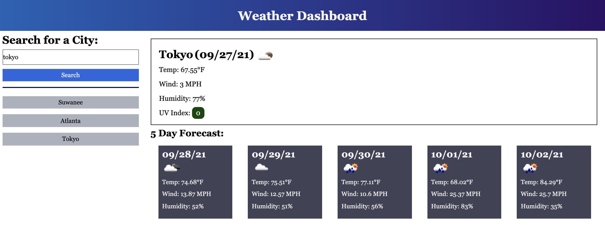

# weather-dashboard

* weather-dashboard is an interactive site that will allow the user to search for cities, see the current and future weather conditions for that city, and save favorite cities for future searches.

* To use the dashboard: search for a city in the search field, or click on a previously searched city.

* See page at https://caitlinw29.github.io/weather-dashboard/
